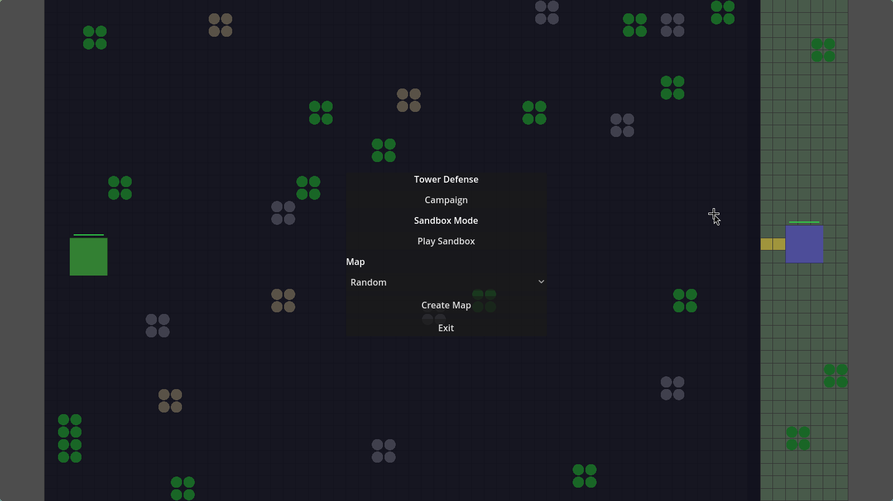

# Tower Defense Prototype (Godot 4)

Prototype tower defense/resource game built with Godot 4.

**Author**: Caleb Keller

## Quick Start
- Open the project in Godot 4.
- Run the main scene: `scenes/Main.tscn`.

## Project Structure
- `scenes/`: PackedScene assets (units, buildings, projectiles, etc.).
- `scripts/`: Gameplay logic (Main, Economy, Placement, ResourceSpawner, UI).
- `data/`: Campaign level JSON files.
- `tests/`: Lightweight GDScript test runner.
- `assets/`: Screenshots and other repo assets.

## Screenshot

## Tests
Tests are run via Godot locally:
- Runner: `tests/run_tests.gd`
- Note: Codex sandbox cannot execute Godot headless.

## Notes
- UI is built in `scripts/UiBuilder.gd`.
- Resource spawn logic lives in `scripts/ResourceSpawner.gd`.
- Build/placement logic lives in `scripts/Placement.gd`.
- Economy and button enabling lives in `scripts/Economy.gd`.

## License
Source-available. See `LICENSE`.
